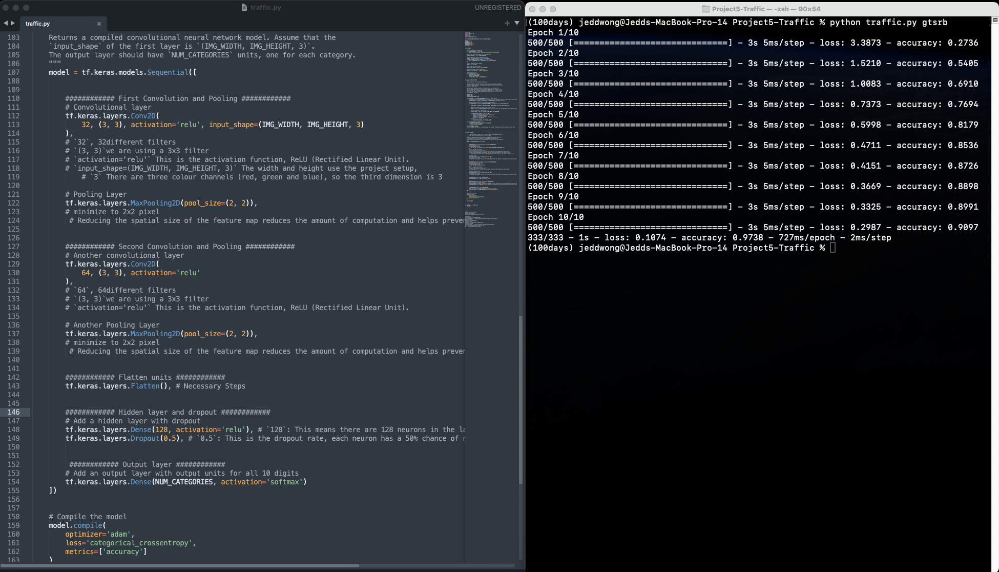

# jeddstudio - Traffic
---
[Project 5 - Traffic Video](https://youtu.be/CI7oKF9YXFg)

dataset not in the repository
 Download the [data set](https://cdn.cs50.net/ai/2023/x/projects/5/gtsrb.zip) for this project and unzip it. Move the resulting `gtsrb` directory inside of your `traffic` directory.


### Usage
`python3 traffic.py gtsrb`
- The gtsrb is the dataset folder 


## Traffic
This project uses the TensorFlow Keras Convolutional Neural Network(CNN) model - Sequence model

#### Result: 
```
(100days) jeddwong@Jedds-MacBook-Pro-14 Project5-Traffic % python traffic.py gtsrb
Epoch 1/10
500/500 [==============================] - 3s 5ms/step - loss: 3.3873 - accuracy: 0.2736  Epoch 2/10
500/500 [==============================] - 3s 5ms/step - loss: 1.5210 - accuracy: 0.5405
Epoch 3/10
500/500 [==============================] - 3s 5ms/step - loss: 1.0083 - accuracy: 0.6910
Epoch 4/10
500/500 [==============================] - 3s 5ms/step - loss: 0.7373 - accuracy: 0.7694
Epoch 5/10
500/500 [==============================] - 3s 5ms/step - loss: 0.5998 - accuracy: 0.8179
Epoch 6/10
500/500 [==============================] - 3s 5ms/step - loss: 0.4711 - accuracy: 0.8536
Epoch 7/10
500/500 [==============================] - 3s 5ms/step - loss: 0.4151 - accuracy: 0.8726
Epoch 8/10
500/500 [==============================] - 3s 5ms/step - loss: 0.3669 - accuracy: 0.8898
Epoch 9/10
500/500 [==============================] - 3s 5ms/step - loss: 0.3325 - accuracy: 0.8991
Epoch 10/10
500/500 [==============================] - 3s 5ms/step - loss: 0.2987 - accuracy: 0.9097
333/333 - 1s - loss: 0.1074 - accuracy: 0.9738 - 727ms/epoch - 2ms/step
(100days) jeddwong@Jedds-MacBook-Pro-14 Project5-Traffic % 
```
#### Epoch 1 and Epoch 10
- Epoch 1 is `loss: 3.3873 - accuracy: 0.2736`
- Epoch 10 is `loss: 0.1074 - accuracy: 0.9738`
- We can see that there has been a significant improvement in the detection between Epoch 1 and Epoch 10!
    - The project document showcase is `loss: 0.1616 - accuracy: 0.9535`, so I think my project has done its job well


##### Test Setting

- There are 2 Convolution and Pooling.
- Add the Second set of Convolution and Pooling
- Convolutional layer: 64 filters and a 3x3 kernel `64, (3, 3)`
    - Why set it to `64`?
        - the spatial dimensions (width and height) of the feature maps are often reduced, so the computational burden can be reduced.
        - Increasing the number of filters increases the capacity of the network to learn more complex feature representations.
- Pooling Layer: `pool_size=(2, 2)`
- Hidden layer with dropout: `128` units and dropout of `0.5`


##### Conclusion
- The "Handwriting" in the lecture demonstration is only a small number of black and white images, so there is no need to use more than 1 set of convolution and pooling
- The images used by "Traffic" are in colour and the number of images is much larger than that of "Handwriting", so it is a good example to show the effect of using more than one set of convolution and pooling


### Reflect on the Learning
- Since only one convolution and pooling is used in the lecture, here is a practical exercise to try to add one more convolution and pooling in training the model so that I can have a deeper understanding of the concept.
- There are many ways to improve the performance of a model, and adjusting the parameters is one of them, but adding just two more lines of code to add one more set of convolution and pooling to the model already improves the model's performance significantly without adjusting the parameters.
- Time is an important cost in the AI field. Although parameter tuning can also effectively improve model performance, if a large dataset is used to train the model, the cost of each parameter tuning and testing will become higher. Therefore, by understanding the fundamentals of AI, we will be able to better face the challenges that may arise in the future.


