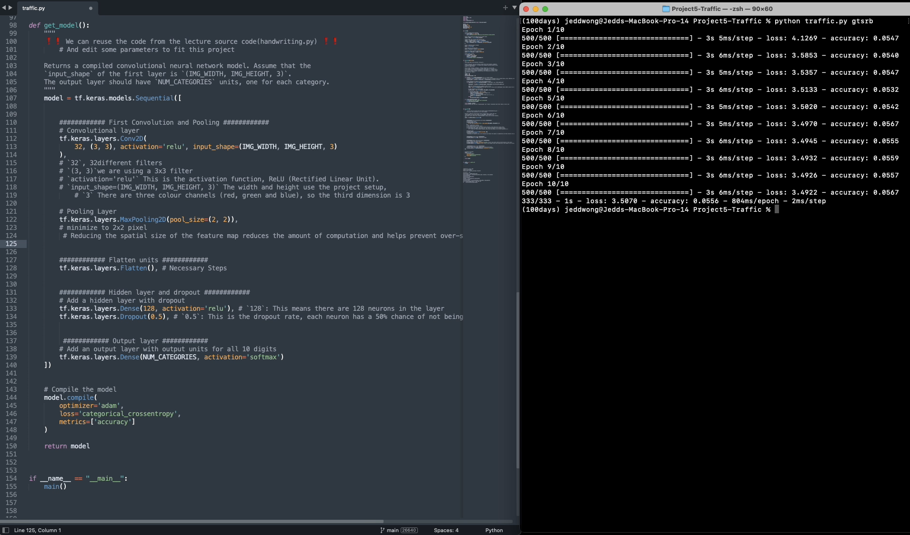
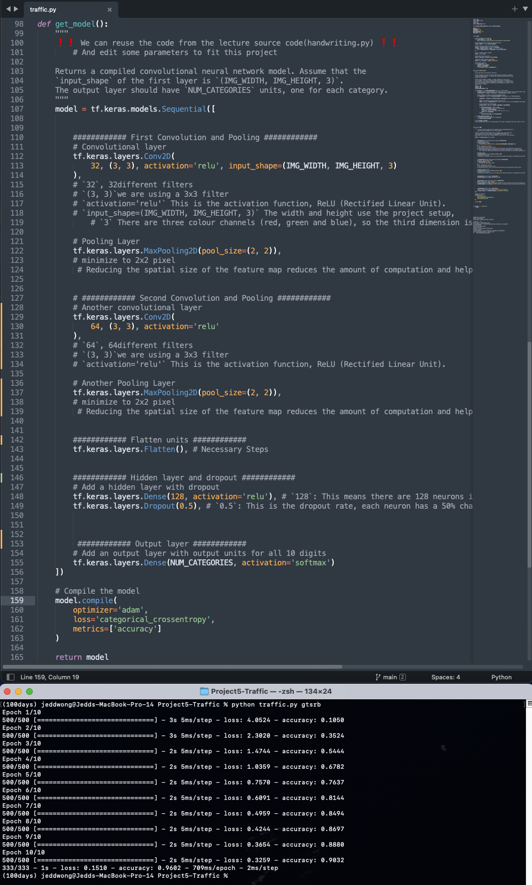

# jeddstudio - Traffic
---
[Project 5 - Traffic Video](https://youtu.be/jv11slst1J0)

dataset not in the repository

This project uses the TensorFlow Keras Convolutional Neural Network(CNN) model - Sequence model

I conducted two tests.

### 1st Test

##### 1st Test Setting
- I use the same settings as "handwriting.py" in the course
- Convolutional layer: 32 filters and a 3x3 kernel `32, (3, 3)`
    - `input_shape=(IMG_WIDTH, IMG_HEIGHT, 3)`
        - `3` is for 3 different channels(red, green, blue)
- Pooling Layer: `pool_size=(2, 2)`
- Hidden layer with dropout: `128` units and dropout of `0.5`

##### Result: 
`333/333 - 1s - loss: 3.5070 - accuracy: 0.0556 - 804ms/epoch - 2ms/step`
- The training took about 32 seconds
- The `loss` is as high as 3.5070, which means that the model's prediction is not very accurate
- The `accuracy` is only 5.56%, this is a very low accuracy rate and it indicates that the model is not performing well

##### Conclusion
- The dataset of "Handwriting" training is only a small number of black and white pictures.
- The dataset for traffic is much more than "Handwriting", so only one set of convolution and pooling training is not enough

### 2nd Test
##### 2nd Test Setting

- The First Convolution and Pooling setting are the same as the 1st Test
- Add the Second set of Convolution and Pooling
- Convolutional layer: 64 filters and a 3x3 kernel `64, (3, 3)`
    - Why set it to `64`?
        - the spatial dimensions (width and height) of the feature maps are often reduced, so the computational burden can be reduced.
        - Increasing the number of filters increases the capacity of the network to learn more complex feature representations.
- Pooling Layer: `pool_size=(2, 2)`
- Hidden layer with dropout: `128` units and dropout of `0.5`

##### Result: 
`333/333 - 1s - loss: 0.1354 - accuracy: 0.9641 - 741ms/epoch - 2ms/step`
- The training took about 36 seconds
- The `loss` is 0.1354, which means that significantly improved prediction of the model
- The `accuracy` is 96.41%, Indicates that the model has completed its work satisfactorily.

##### Conclusion
- The "Handwriting" in the lecture demonstration is only a small number of black and white images, so there is no need to use more than 1 set of convolution and pooling
- The images used by "Traffic" are in colour and the number of images is much larger than that of "Handwriting", so it is a good example to show the effect of using more than one set of convolution and pooling
- Also worth noting is the time. Although it is only about 6 seconds longer in the 2nd Test, it is about 20% longer than the 1st Test
    - If we need to train a larger dataset with a larger base, 20% a significant number

### Reflect on the Learning
- Since only one convolution and pooling is used in the lecture, here is a practical exercise to try to add one more convolution and pooling in training the model so that I can have a deeper understanding of the concept.
- There are many ways to improve the performance of a model, and adjusting the parameters is one of them, but adding just two more lines of code to add one more set of convolution and pooling to the model already improves the model's performance significantly without adjusting the parameters.
- Time is an important cost in the AI field. Although parameter tuning can also effectively improve model performance, if a large dataset is used to train the model, the cost of each parameter tuning and testing will become higher. Therefore, by understanding the fundamentals of AI, we will be able to better face the challenges that may arise in the future.

